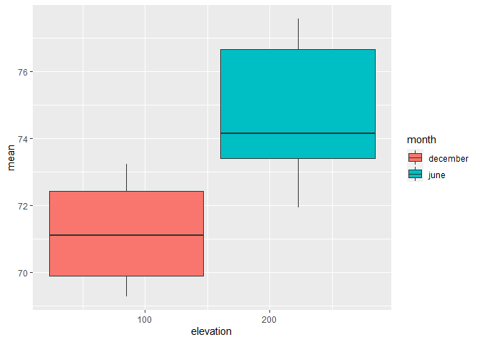
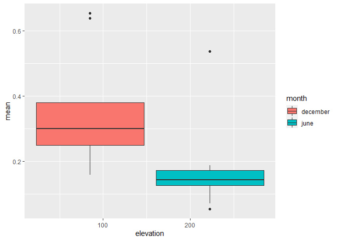

Surfs Up
================

# Overview

W. Avy likes your analysis, but he wants more information about
temperature trends before opening the surf shop. Specifically, he wants
temperature data for the months of June and December in Oahu, in order
to determine if the surf and ice cream shop business is sustainable
year-round.

# Results

### Temperature difference between June and December

<table>
<thead>
<tr>
<th style="text-align:left;">
month
</th>
<th style="text-align:right;">
count
</th>
<th style="text-align:right;">
std
</th>
<th style="text-align:right;">
mean
</th>
<th style="text-align:right;">
25%
</th>
<th style="text-align:right;">
50%
</th>
<th style="text-align:right;">
75%
</th>
<th style="text-align:right;">
min
</th>
<th style="text-align:right;">
max
</th>
</tr>
</thead>
<tbody>
<tr>
<td style="text-align:left;">
december
</td>
<td style="text-align:right;">
1517
</td>
<td style="text-align:right;">
3.745920
</td>
<td style="text-align:right;">
71.04153
</td>
<td style="text-align:right;">
69
</td>
<td style="text-align:right;">
71
</td>
<td style="text-align:right;">
74
</td>
<td style="text-align:right;">
56
</td>
<td style="text-align:right;">
83
</td>
</tr>
<tr>
<td style="text-align:left;">
june
</td>
<td style="text-align:right;">
1700
</td>
<td style="text-align:right;">
3.257417
</td>
<td style="text-align:right;">
74.94412
</td>
<td style="text-align:right;">
73
</td>
<td style="text-align:right;">
75
</td>
<td style="text-align:right;">
77
</td>
<td style="text-align:right;">
64
</td>
<td style="text-align:right;">
85
</td>
</tr>
</tbody>
</table>

### Average Rain for June and December

<table>
<thead>
<tr>
<th style="text-align:left;">
month
</th>
<th style="text-align:right;">
count
</th>
<th style="text-align:right;">
std
</th>
<th style="text-align:right;">
mean
</th>
<th style="text-align:right;">
25%
</th>
<th style="text-align:right;">
50%
</th>
<th style="text-align:right;">
75%
</th>
<th style="text-align:right;">
min
</th>
<th style="text-align:right;">
max
</th>
<th style="text-align:right;">
total rain
</th>
</tr>
</thead>
<tbody>
<tr>
<td style="text-align:left;">
december
</td>
<td style="text-align:right;">
895
</td>
<td style="text-align:right;">
0.6467039
</td>
<td style="text-align:right;">
0.3403687
</td>
<td style="text-align:right;">
0.03
</td>
<td style="text-align:right;">
0.10
</td>
<td style="text-align:right;">
0.33
</td>
<td style="text-align:right;">
0.01
</td>
<td style="text-align:right;">
6.42
</td>
<td style="text-align:right;">
304.63
</td>
</tr>
<tr>
<td style="text-align:left;">
june
</td>
<td style="text-align:right;">
927
</td>
<td style="text-align:right;">
0.4115957
</td>
<td style="text-align:right;">
0.2315318
</td>
<td style="text-align:right;">
0.03
</td>
<td style="text-align:right;">
0.09
</td>
<td style="text-align:right;">
0.24
</td>
<td style="text-align:right;">
0.01
</td>
<td style="text-align:right;">
4.43
</td>
<td style="text-align:right;">
214.63
</td>
</tr>
</tbody>
</table>

### Temperature for each station and month.

<!-- -->

### Average Rain for each station and month.

<!-- -->

# Summary

The temperatures between June and December are roughly the same, however
December seems to a wider range of temperatures.

The amount of rain is greater in December as well.

The higher the elevation the warmer it seems to get and have less rain
as well.
